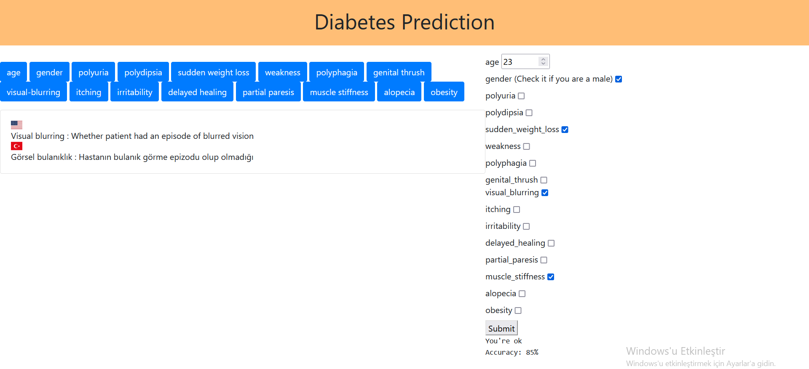
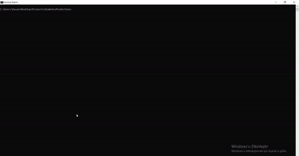

# Diabetes Prediction 



## What is Diabetes?

Diabetes is a chronic (long-lasting) health condition that affects how your body turns food into energy.

Most of the food you eat is broken down into sugar (also called glucose) and released into your bloodstream. When your blood sugar goes up, it signals your pancreas to release insulin. Insulin acts like a key to let the blood sugar into your body’s cells for use as energy.

If you have diabetes, your body either doesn’t make enough insulin or can’t use the insulin it makes as well as it should. When there isn’t enough insulin or cells stop responding to insulin, too much blood sugar stays in your bloodstream. Over time, that can cause serious health problems, such as heart disease, vision loss, and kidney disease.

There isn’t a cure yet for diabetes, but losing weight, eating healthy food, and being active can really help. Taking medicine as needed, getting diabetes self-management education and support, and keeping health care appointments can also reduce the impact of diabetes on your life.

## Working Example

---



## Run Web App on Your Local Machine

---

* Clone repository to your local machine
```
git clone https://github.com/aliosmankaya/diabetesPrediction.git
```
* Install requirements
```
pip install -r requirements.txt
```
* Run Web App
```
python app.py   # Windows 
```
```
python3 app.py  # Linux
```
* Locate on your browser
```
http://127.0.0.1:5000
```